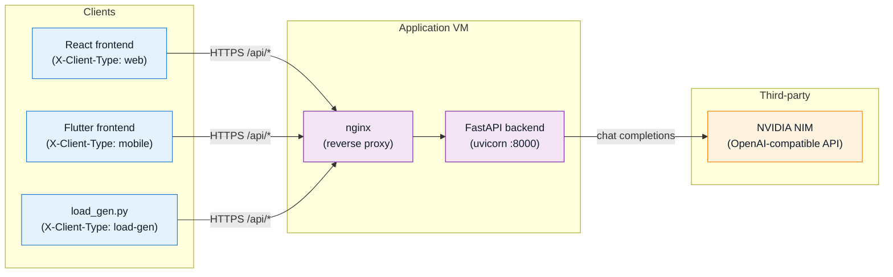
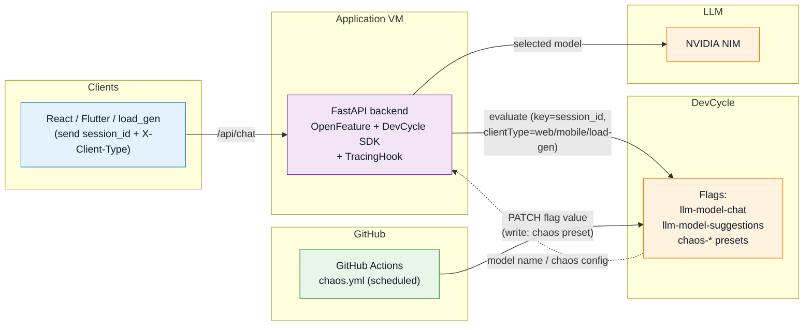
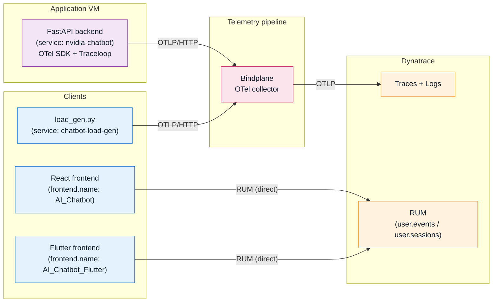
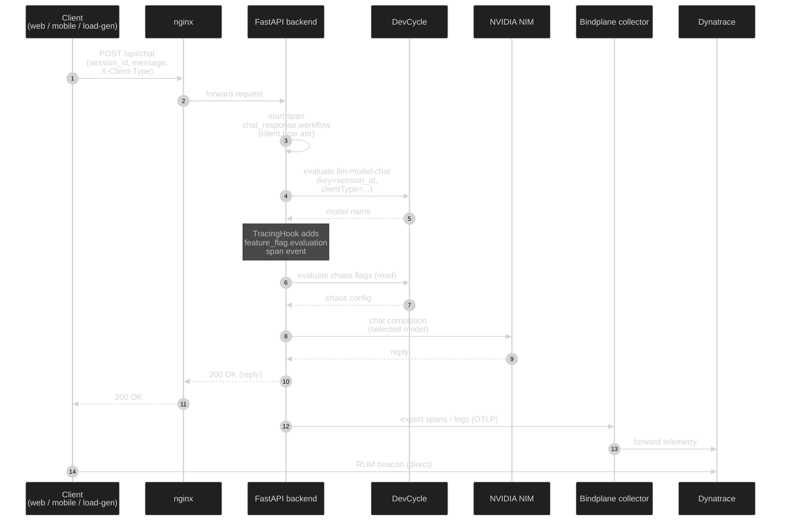

# Architecture Diagrams

Visual references for the NVIDIA Chatbot system across four lenses:
components, feature flags, observability, and request lifecycle.

For prose-level architecture detail, see
[`architecture.md`](architecture.md).

---

## 1. Components & dependencies

How clients reach the backend and what the backend depends on. The
`X-Client-Type` header is load-bearing — it drives DevCycle audience
targeting and Dynatrace span filtering.

---

## 2. Feature flags (DevCycle / OpenFeature)

Three flows share the same DevCycle backend:

- **LLM A/B (read)** — backend resolves `llm-model-chat` and
  `llm-model-suggestions` per session, keyed by session ID with
  `clientType` as a custom attribute.
- **Chaos (read)** — backend evaluates chaos flags via OpenFeature.
  The backend is **read-only** for chaos state.
- **Chaos preset (write)** — the scheduled GitHub Actions workflow
  (`.github/workflows/chaos.yml`) mutates DevCycle flag values to apply
  a chaos preset.

Every evaluation emits a `feature_flag.evaluation` **span event** on the
active parent span via the OpenFeature `TracingHook`, which is what makes
flag activity visible in Dynatrace (see diagram 3).

---

## 3. Observability

All telemetry funnels through a Bindplane OTel collector before reaching
Dynatrace. RUM bypasses the collector and goes direct from each frontend
to Dynatrace.

---

## 4. Request lifecycle — `POST /api/chat`

End-to-end sequence for a single chat call, including flag evaluation
and telemetry emission. This ties together the previous three diagrams.

